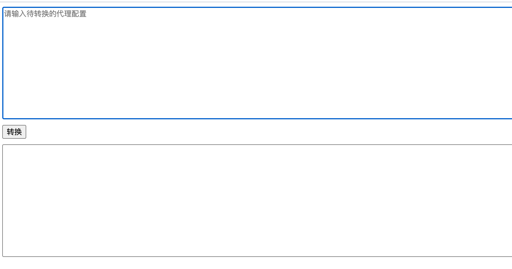

# 代理配置转换工具

代码是复制粘贴和AI写的的，感谢 gui-for-singbox 插件 原作者：https://github.com/GUI-for-Cores/Plugin-Hub/blob/main/plugins/Generic/plugin-node-convert.js

下面也是AI写的，将就看吧

可以直接下载使用，也可以访问 pages.cloudflare 使用

## 项目介绍
这是一个用于将 v2ray 格式的订阅配置转换为sing-box格式的Web工具。
支持多种代理协议,能够将配置快速转换为sing-box可用的JSON格式。

## 功能特性
- 支持Base64编码输入
- 支持多行配置批量转换
- 输出标准sing-box JSON格式
- 纯前端实现,无需后端服务
- 实时错误提示

## 使用方法
1. 在输入框中粘贴需要转换的代理配置(支持Base64)
2. 点击"转换"按钮
3. 在输出框中获取转换后的sing-box配置

## 一些支持的协议
- Shadowsocks
- VMess
- Trojan
- VLESS

## 开发说明
本工具使用纯JavaScript实现,主要文件:
- index.html - 主界面
- test.js - 协议解析和转换逻辑

## 注意事项
- 确保输入格式正确
- 转换错误会在控制台输出
- 不支持的协议会自动跳过

## License
MIT
